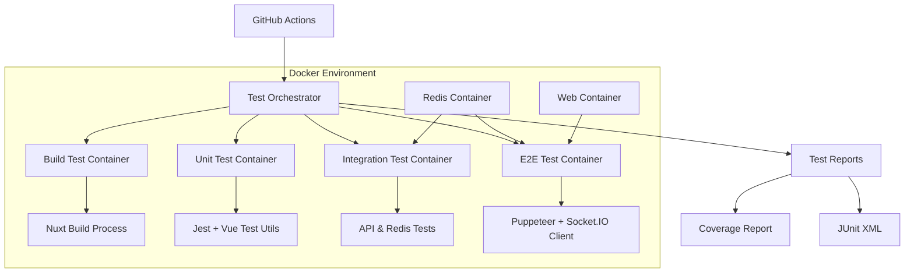
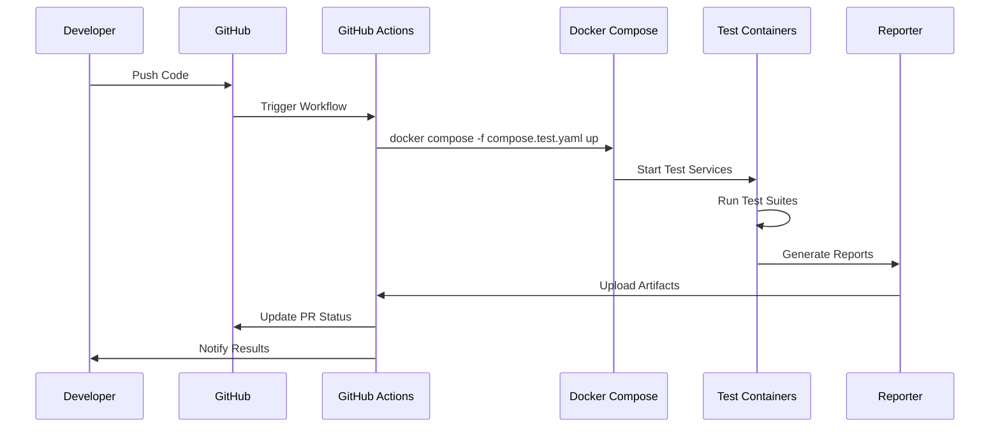
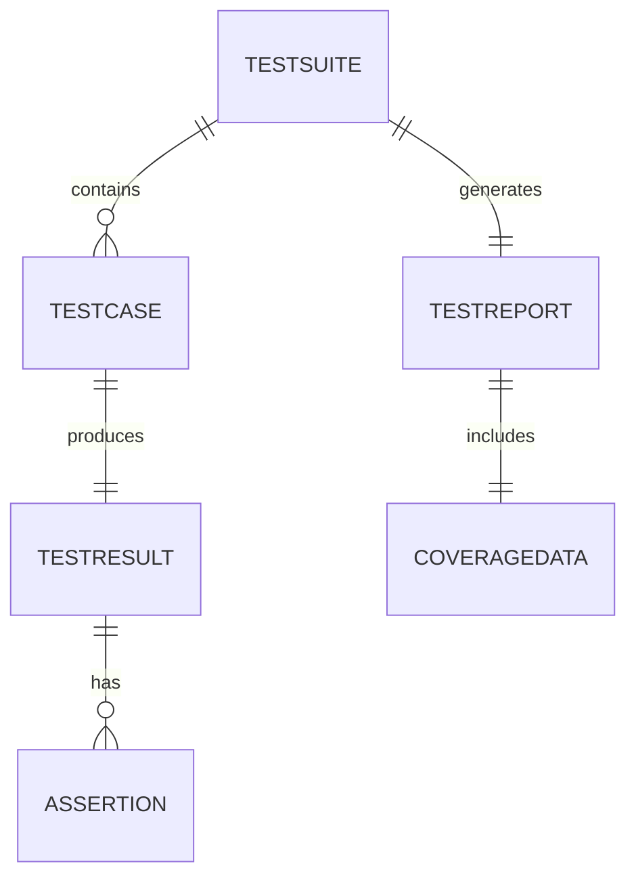
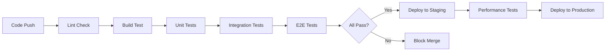

# Technical Design

## 概要

本設計書は、Shogiwebroomアプリケーションに対する包括的な自動テストシステムの実装アプローチを定義します。Docker環境での完全な分離テスト、継続的インテグレーション、そして本番環境へのデプロイ前の品質保証を実現します。

## 要件マッピング

### 設計コンポーネントのトレーサビリティ

各設計コンポーネントが対応する要件：

- **Docker Test Environment** → REQ-1: Dockerテスト環境の構築
- **Build Verification System** → REQ-2: ビルドプロセスの検証
- **Server Testing Framework** → REQ-3: サーバー起動テスト
- **Redis Testing Module** → REQ-4: Redis接続テスト
- **Component Testing Suite** → REQ-5: UIコンポーネントのレンダリングテスト
- **E2E WebSocket Tests** → REQ-6: WebSocket機能のEnd-to-Endテスト
- **CI/CD Integration** → REQ-7: CI/CDパイプライン統合
- **Test Reporter** → REQ-8: テストカバレッジとレポート

### ユーザーストーリーのカバレッジ

- **環境依存問題の検出**: Docker環境での完全な分離により実現
- **ビルド検証の自動化**: 専用テストコンテナとスクリプトで対応
- **サーバー起動確認**: ヘルスチェックとエンドポイントテストで実装
- **Redis通信検証**: 専用テストスクリプトとモックサーバーで実現
- **UI検証**: Vue Test UtilsとJSDOMでSSR環境をシミュレート
- **リアルタイム同期確認**: Socket.IO Clientを使用したE2Eテスト
- **CI/CD自動実行**: GitHub Actionsワークフローで統合
- **レポート生成**: Jest報告とカスタムレポーターで実現

## アーキテクチャ



### 技術スタック

テスト研究と要件分析に基づく選定：

- **テストランナー**: Jest 26.x（Nuxt.js 2.xとの互換性）
- **Vueコンポーネントテスト**: @vue/test-utils 1.x + jest-serializer-vue
- **E2Eテスト**: Puppeteer + Socket.IO Client
- **アサーション**: Chai / Jest Expect
- **モック**: Jest Mocks + Sinon for Socket.IO
- **カバレッジ**: Istanbul (jest --coverage)
- **レポート**: Jest HTML Reporter + Allure
- **CI/CD**: GitHub Actions + Docker Layer Caching

### アーキテクチャ決定の根拠

- **なぜJest**: Nuxt.js 2.xの公式サポート、Vue Test Utilsとの統合、カバレッジ機能内蔵
- **なぜPuppeteer**: ヘッドレスChrome、Socket.IO対応、Docker内での安定動作
- **なぜ複数コンテナ**: テストタイプごとの分離、並列実行、リソース最適化
- **なぜGitHub Actions**: 既存のCI/CD設定との統合、Dockerサポート、無料枠

## データフロー

### テスト実行フロー



## コンポーネントとインターフェース

### バックエンドサービス & メソッドシグネチャ

```javascript
class TestOrchestrator {
  async runAllTests(): Promise<TestReport>       // 全テストスイート実行
  async runBuildTest(): Promise<BuildResult>     // ビルドテスト実行
  async runUnitTests(): Promise<TestResults>     // ユニットテスト実行
  async runIntegrationTests(): Promise<TestResults>  // 統合テスト実行
  async runE2ETests(): Promise<TestResults>      // E2Eテスト実行
  generateReport(results: TestResults[]): Report // レポート生成
}

class RedisTestClient {
  async testConnection(): Promise<boolean>       // 接続テスト
  async testUpstashAPI(): Promise<boolean>      // Upstash REST API検証
  async testOperations(): Promise<TestResults>   // CRUD操作テスト
}

class SocketTestClient {
  async connectMultipleClients(count: number): Promise<Client[]>  // 複数接続
  async testRoomSync(roomId: string): Promise<boolean>           // 同期テスト
  async testMoveEvent(move: Move): Promise<boolean>              // 駒移動テスト
}
```

### フロントエンドコンポーネント

| コンポーネント名 | 責任 | Props/State概要 |
|-----------------|------|----------------|
| TestRunner | テスト実行管理 | testSuites, currentTest, results |
| TestMonitor | リアルタイムログ表示 | logs, status, progress |
| CoverageViewer | カバレッジ表示 | coverageData, threshold |
| ReportGenerator | レポート生成 | testResults, format |

### APIエンドポイント

| メソッド | ルート | 目的 | 認証 | ステータスコード |
|---------|-------|------|-----|-----------------|
| GET | /api/test/status | テスト実行状態取得 | 不要 | 200, 500 |
| POST | /api/test/run | テスト実行開始 | 不要 | 202, 400, 500 |
| GET | /api/test/results/:id | テスト結果取得 | 不要 | 200, 404, 500 |
| GET | /api/test/coverage | カバレッジ取得 | 不要 | 200, 500 |
| POST | /api/test/stop | テスト停止 | 不要 | 200, 500 |

## データモデル

### ドメインエンティティ

1. **TestSuite**: テストスイートの定義と設定
2. **TestCase**: 個別テストケースの定義
3. **TestResult**: テスト実行結果
4. **TestReport**: 統合レポート
5. **CoverageData**: カバレッジ情報

### エンティティ関係



### データモデル定義

```typescript
interface TestSuite {
  id: string;
  name: string;
  type: 'unit' | 'integration' | 'e2e';
  testCases: TestCase[];
  config: TestConfig;
  createdAt: Date;
}

interface TestCase {
  id: string;
  suiteId: string;
  name: string;
  description: string;
  assertions: Assertion[];
  timeout: number;
}

interface TestResult {
  id: string;
  testCaseId: string;
  status: 'passed' | 'failed' | 'skipped';
  duration: number;
  error?: Error;
  timestamp: Date;
}

interface TestReport {
  id: string;
  suiteResults: TestResult[];
  coverage: CoverageData;
  totalTests: number;
  passed: number;
  failed: number;
  skipped: number;
  duration: number;
  generatedAt: Date;
}

interface CoverageData {
  lines: { total: number; covered: number; percentage: number };
  functions: { total: number; covered: number; percentage: number };
  branches: { total: number; covered: number; percentage: number };
  statements: { total: number; covered: number; percentage: number };
}
```

## テスト環境構成

### Docker Compose Test Configuration

```yaml
# compose.test.yaml
services:
  test-orchestrator:
    build:
      context: .
      dockerfile: Dockerfile.test
    volumes:
      - .:/app:cached
      - /app/node_modules
      - test-results:/app/test-results
    environment:
      - NODE_ENV=test
      - TEST_MODE=full
    depends_on:
      - redis
      - web
    command: ["npm", "run", "test:all"]

  test-unit:
    extends: test-orchestrator
    command: ["npm", "run", "test:unit"]

  test-integration:
    extends: test-orchestrator
    command: ["npm", "run", "test:integration"]

  test-e2e:
    extends: test-orchestrator
    command: ["npm", "run", "test:e2e"]
```

### テストスクリプト構成

```javascript
// scripts/test-runner.js
const orchestrator = new TestOrchestrator({
  suites: ['unit', 'integration', 'e2e'],
  parallel: true,
  timeout: 300000,
  reporters: ['json', 'html', 'junit']
});

// scripts/test-redis.js
const redisTest = new RedisTestClient({
  url: process.env.REDIS_URL,
  testMode: 'full'
});

// scripts/test-websocket.js
const socketTest = new SocketTestClient({
  serverUrl: 'http://web:3000',
  numClients: 5
});
```

## エラーハンドリング

### テスト失敗の処理

- **即座のフィードバック**: 失敗時に詳細なスタックトレース
- **スクリーンショット**: E2Eテスト失敗時の画面キャプチャ
- **ログ収集**: 関連するアプリケーションログの自動収集
- **リトライ機構**: 不安定なテストに対する自動リトライ（最大3回）

### タイムアウト管理

- ユニットテスト: 10秒
- 統合テスト: 30秒
- E2Eテスト: 60秒
- 全体のタイムアウト: 10分

## セキュリティ考慮事項

### テスト環境の分離

- テスト専用のRedisインスタンス
- 本番データベースへのアクセス禁止
- テスト用の環境変数分離

### 機密情報の管理

- GitHub Secretsでの環境変数管理
- テストログからの機密情報除外
- モックデータの使用

## パフォーマンス & スケーラビリティ

### パフォーマンス目標

| メトリック | 目標 | 測定方法 |
|-----------|------|---------|
| ユニットテスト実行時間 | < 1分 | Jest timer |
| 統合テスト実行時間 | < 3分 | Docker logs |
| E2Eテスト実行時間 | < 5分 | Puppeteer metrics |
| 全テスト実行時間 | < 10分 | CI/CD duration |
| 並列実行数 | 4 | Docker containers |

### 最適化戦略

- **テストの並列実行**: Jest --maxWorkers=4
- **Dockerレイヤーキャッシング**: buildxによる効率化
- **選択的テスト実行**: 変更ファイルに基づくテスト選択
- **テストデータの事前準備**: Fixtureの活用

## テスト戦略

### テストカバレッジ要件

- **ユニットテスト**: ≥70% コードカバレッジ
- **統合テスト**: 全APIエンドポイントとRedis操作
- **E2Eテスト**: 主要なユーザーフロー5つ
- **パフォーマンステスト**: 100同時接続

### テストアプローチ

1. **ユニットテスト**
   - Vueコンポーネントの個別テスト
   - Vuexストアのアクション/ミューテーション
   - ユーティリティ関数

2. **統合テスト**
   - Express APIエンドポイント
   - Redis接続と操作
   - Socket.IOイベントハンドリング

3. **E2Eテスト**
   - ルーム作成と参加フロー
   - 駒の移動と同期
   - チャット機能
   - 棋譜の保存と読み込み
   - 複数デバイス間の同期

4. **パフォーマンステスト**
   - Artillery.ioによる負荷テスト
   - メモリリークの検出
   - WebSocket接続数の上限確認

### CI/CDパイプライン



### GitHub Actions設定

```yaml
# .github/workflows/test.yml
name: Test Suite
on:
  pull_request:
  push:
    branches: [master]

jobs:
  test:
    runs-on: ubuntu-latest
    steps:
      - uses: actions/checkout@v4
      - name: Set up Docker Buildx
        uses: docker/setup-buildx-action@v3
      - name: Cache Docker layers
        uses: actions/cache@v4
        with:
          path: /tmp/.buildx-cache
          key: ${{ runner.os }}-buildx-${{ hashFiles('**/package-lock.json') }}
      - name: Run tests
        run: docker compose -f compose.test.yaml up --abort-on-container-exit
      - name: Upload coverage
        uses: actions/upload-artifact@v3
        with:
          name: coverage-report
          path: test-results/coverage
```