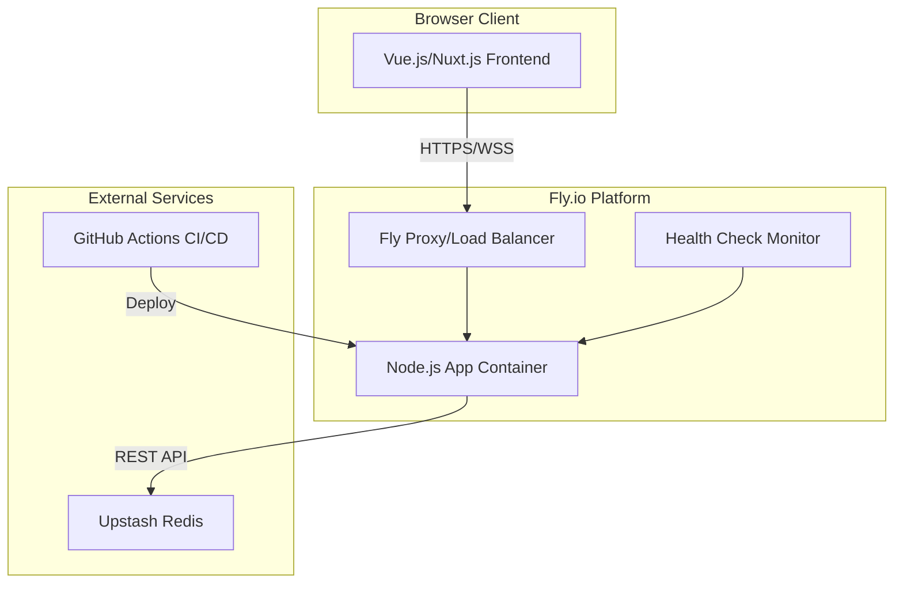
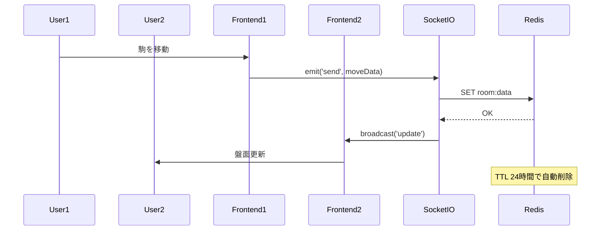
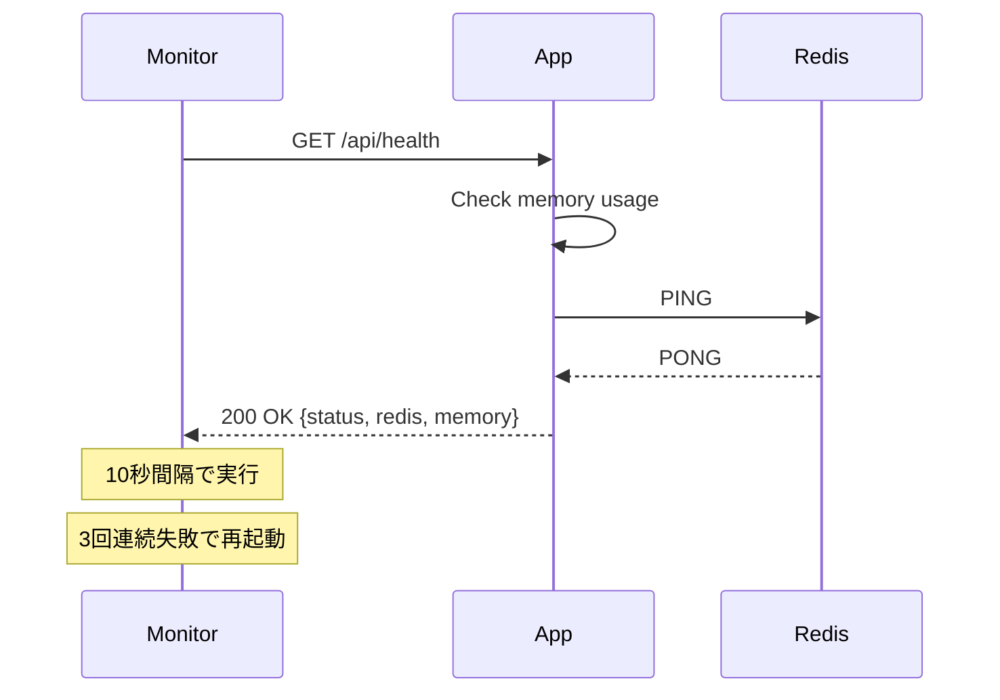
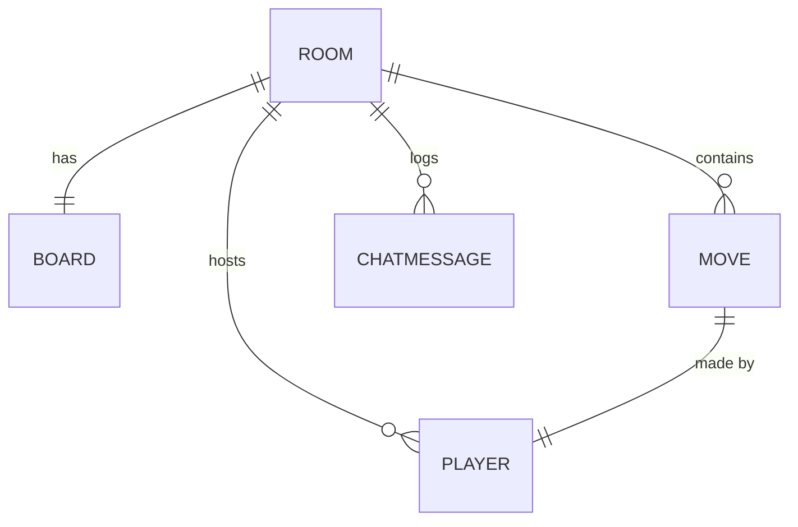
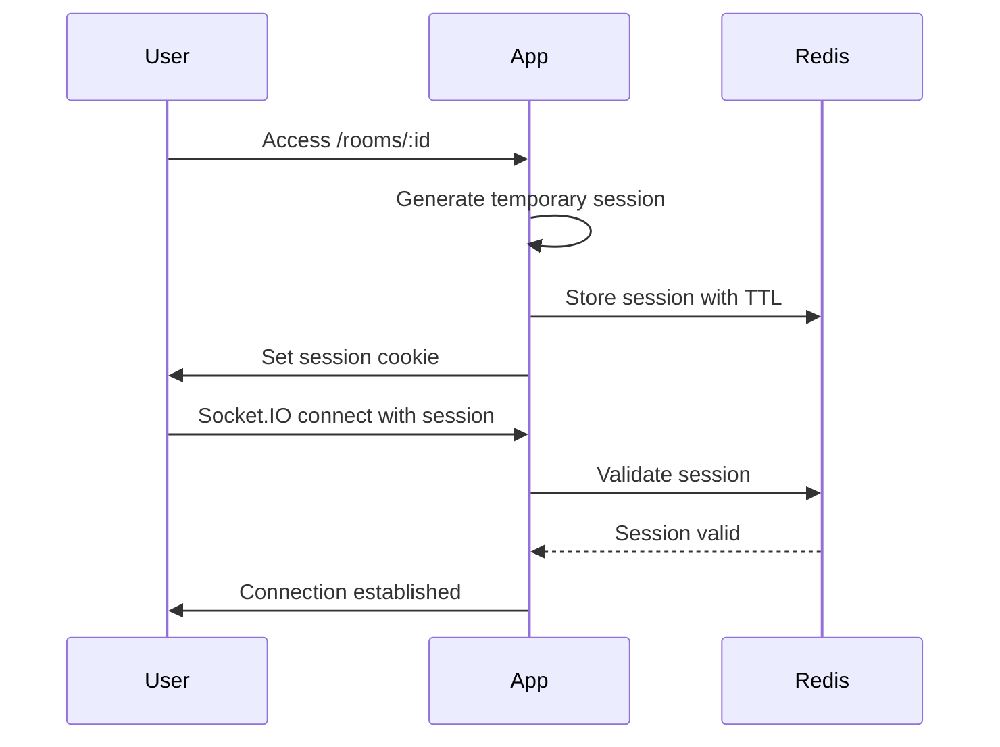

# Technical Design

## 概要

将棋ウェブルーム（Shogiwebroom）プロジェクトのコンテナ化およびFly.ioへのデプロイメント移行に関する技術設計書です。本設計は、要件定義書に基づき、Dockerによる環境統一、Fly.ioでの低コスト運用、Upstash Redis統合、Node.js 18+互換性対応を実現するための具体的なアーキテクチャと実装方針を定義します。

webchessclockプロジェクトで実証済みのアプローチを採用し、月額$10以内での安定運用を実現しながら、開発効率の向上と運用の自動化を達成します。

## Requirements Mapping

### Design Component Traceability

各設計コンポーネントが対応する要件を明確化：

- **Dockerマルチステージビルド** → 要件1.1: Node.js 18+ Alpineベースイメージ使用
- **Docker Compose構成** → 要件1.2, 1.5: 開発環境のホットリロードとRedis統合
- **Fly.io設定** → 要件2.1-2.6: 低コストデプロイメント環境
- **Upstashクライアントラッパー** → 要件3.1-3.6: Redis互換性と無料枠活用
- **Node.js互換性レイヤー** → 要件4.1-4.6: Nuxt 2.x + Node.js 18対応
- **ヘルスチェックAPI** → 要件5.1-5.6: 監視とロギング
- **GitHub Actions** → 要件6.1-6.6: CI/CDパイプライン
- **開発環境最適化** → 要件7.1-7.6: Docker開発環境
- **ドキュメント** → 要件8.1-8.6: 運用・開発ガイド
- **コスト監視** → 要件9.1-9.6: 月額$10以内の制御

### User Story Coverage

- **開発者ストーリー**: Dockerによる環境統一、Node.js 18+対応、CI/CD自動化で開発効率向上
- **プロダクトオーナーストーリー**: Fly.ioによる低コスト運用、自動スケーリングで運用負荷削減
- **システム管理者ストーリー**: Upstash Redis統合、ヘルスチェック実装で安定運用
- **新規参加者ストーリー**: 包括的なドキュメントとDocker環境で迅速なオンボーディング

## Architecture

### システム全体構成



### Technology Stack

#### コンテナ基盤
- **Docker**: 20.10+ with BuildKit
- **Docker Compose**: v2.x for development
- **Base Image**: node:18-alpine3.18

#### アプリケーション層
- **Frontend**: Nuxt.js 2.18.1 + Vue.js 2.x + TypeScript
- **Backend**: Express.js 4.x + Socket.IO 2.x
- **Runtime**: Node.js 18 LTS with OpenSSL legacy provider

#### インフラストラクチャ
- **Deployment**: Fly.io Machines v2 (Tokyo region)
- **Data Store**: Upstash Redis (Global with Tokyo edge)
- **Monitoring**: Fly.io metrics + UptimeRobot
- **CI/CD**: GitHub Actions

### Architecture Decision Rationale

#### なぜFly.io
- **研究結果**: 2025年時点で最もコスト効率の良いWebSocket対応PaaS
- **$0スタート**: トラフィックゼロ時は完全無料、auto_stop機能でコスト最適化
- **東京リージョン**: 日本ユーザー向けに低レイテンシ（10ms以下）
- **Socket.IO完全対応**: WebSocket永続接続を低コストでサポート

#### なぜUpstash Redis
- **無料枠充実**: 日額10,000コマンドまで無料（将棋アプリには十分）
- **REST API**: ファイアウォール制限なし、Fly.ioとの相性良好
- **グローバルレプリケーション**: 東京エッジでの低レイテンシアクセス
- **自動バックアップ**: データ保護機能が無料枠でも利用可能

#### なぜDocker Alpine
- **軽量性**: ベースイメージ50MB以下、最終イメージ200MB以下
- **セキュリティ**: 最小限のパッケージで攻撃対象領域を削減
- **ビルド速度**: キャッシュ効率が良く、CI/CDで高速化
- **Fly.io最適化**: 小さいイメージはデプロイとコールドスタートが高速

## Data Flow

### リアルタイム同期フロー



### ヘルスチェックフロー



## Components and Interfaces

### Backend Services

#### RedisClientService
```javascript
class RedisClientService {
    constructor(redisUrl)           // Upstash互換接続を初期化
    async get(key)                  // ルームデータ取得（エラー時null）
    async set(key, value, ttl)      // TTL付きデータ保存
    async ping()                    // ヘルスチェック用
    async getMemoryUsage()          // メモリ使用量取得
    handleError(error)              // エラーログとフォールバック
}
```

#### HealthCheckService
```javascript
class HealthCheckService {
    async getSystemHealth()         // システム全体の健全性
    async getRedisHealth()          // Redis接続状態詳細
    async getMemoryMetrics()        // メモリ使用状況
    formatHealthResponse(data)      // JSON形式でレスポンス生成
}
```

#### SocketService
```javascript
class SocketService {
    handleConnection(socket)        // 新規接続処理
    handleEnterRoom(socket, id)     // ルーム入室処理
    handleSend(params)              // 盤面更新ブロードキャスト
    handleDisconnect(socket)        // 切断処理
    broadcastToRoom(roomId, event, data)  // ルーム内配信
}
```

### Frontend Components

| Component | Responsibility | Props/State |
|-----------|---------------|-------------|
| Shogiboard.vue | 将棋盤の描画と操作 | board state, socket connection |
| Piece.vue | 駒の表示とドラッグ操作 | piece type, position, draggable |
| Chat.vue | チャット機能 | messages[], socket events |
| Option.vue | 設定管理 | font selection, sound settings |
| Hand.vue | 手番表示 | current turn, timer |
| Stock.vue | 持ち駒管理 | captured pieces[] |
| Kif.vue | 棋譜記録と出力 | move history, export format |

### API Endpoints

| Method | Route | Purpose | Auth | Status Codes |
|--------|-------|---------|------|--------------|
| GET | /api/health | システムヘルスチェック | 不要 | 200, 503 |
| GET | /api/health/redis | Redis接続状態詳細 | 不要 | 200, 503 |
| GET | /api/health/memory | メモリ使用状況 | 不要 | 200 |
| WS | /socket.io | WebSocket接続 | 不要 | 101, 400 |
| GET | / | Nuxt.js SSRページ | 不要 | 200 |
| GET | /rooms/:id | ルームページ | 不要 | 200, 404 |

## Data Models

### Domain Entities

1. **Room**: 将棋盤ルームの状態管理
2. **Board**: 盤面状態（SFEN形式）
3. **Move**: 棋譜の1手
4. **ChatMessage**: チャットメッセージ
5. **Player**: 参加者情報（一時的）

### Entity Relationships



### Data Model Definitions

#### TypeScript Interfaces
```typescript
interface Room {
  id: string;
  sfen: string;          // 現在の盤面（SFEN形式）
  moves: Move[];         // 棋譜
  players: string[];     // 接続中のソケットID
  createdAt: Date;
  lastActivity: Date;
}

interface Move {
  from: Position;
  to: Position;
  piece: string;
  captured?: string;
  promote?: boolean;
  timestamp: Date;
  playerId: string;
}

interface ChatMessage {
  id: string;
  roomId: string;
  name: string;
  message: string;
  timestamp: Date;
}

interface Position {
  file: number;  // 1-9
  rank: number;  // 1-9  
}
```

### Redis Data Structure

```
KEY: room:{roomId}
VALUE: JSON {
  sfen: "lnsgkgsnl/1r5b1/ppppppppp/9/9/9/PPPPPPPPP/1B5R1/LNSGKGSNL b - 1",
  moves: [...],
  lastActivity: "2025-01-15T10:00:00Z"
}
TTL: 86400 (24 hours)

KEY: room:{roomId}:chat
VALUE: LIST of ChatMessage JSON
TTL: 86400 (24 hours)
```

### Migration Strategy

- **段階的移行**: HerokuからFly.ioへの無停止移行
- **データ移行**: 既存RedisデータをUpstashへエクスポート/インポート
- **後方互換性**: SFEN/KIF形式は変更なし
- **インデックス戦略**: Redisキーの階層化で検索最適化

## Error Handling

### エラー処理戦略

```javascript
// グローバルエラーハンドラー
class ErrorHandler {
  // Redis接続エラー
  handleRedisError(error) {
    logger.error('Redis connection failed:', error);
    // インメモリフォールバックモードへ切り替え
    return useInMemoryStore();
  }
  
  // Socket.IOエラー
  handleSocketError(socket, error) {
    logger.error('Socket error:', error);
    socket.emit('error', { message: 'Connection issue' });
    socket.disconnect();
  }
  
  // 未処理エラー
  handleUnexpectedError(error) {
    logger.error('Unexpected error:', error);
    // Fly.ioメトリクスへ送信
    metrics.recordError(error);
    // グレースフルシャットダウン
    if (error.critical) {
      process.exit(1);
    }
  }
}
```

### エラーレスポンス形式

```json
{
  "error": {
    "code": "REDIS_UNAVAILABLE",
    "message": "データストアが一時的に利用できません",
    "timestamp": "2025-01-15T10:00:00Z",
    "requestId": "abc123"
  }
}
```

## Security Considerations

### Authentication & Authorization

現在は認証なしのパブリックアクセスだが、将来的な拡張を考慮：



### Data Protection

- **入力検証**: SFEN形式の厳密な検証
- **XSS対策**: チャットメッセージのサニタイズ
- **CSRF対策**: Socket.IOのOrigin検証
- **Rate Limiting**: 1IPあたり100リクエスト/分

### Security Best Practices

- **HTTPS強制**: Fly.ioで自動SSL/TLS
- **セキュリティヘッダー**: helmet.jsで実装
  - X-Frame-Options: DENY
  - X-Content-Type-Options: nosniff
  - Content-Security-Policy設定
- **依存関係管理**: npm audit週次実行
- **コンテナセキュリティ**: 非rootユーザー実行

## Performance & Scalability

### Performance Targets

| Metric | Target | Measurement |
|--------|--------|-------------|
| 初期ロード時間 | < 3秒 | Lighthouse Score |
| Socket.IO接続 | < 500ms | 接続確立時間 |
| 駒移動レスポンス | < 100ms | RTT測定 |
| Redis操作 | < 50ms | Upstashメトリクス |
| メモリ使用量 | < 200MB | Container metrics |
| 同時接続数 | > 100 | Load testing |

### Caching Strategy

- **ブラウザキャッシュ**: 
  - 静的アセット: Cache-Control: max-age=31536000
  - 駒画像: immutableフラグ付き
- **CDN**: Fly.io内蔵CDN（静的ファイル自動配信）
- **Redisキャッシュ**: ルーム状態24時間保持
- **Nuxt.jsキャッシュ**: SSRページキャッシュ

### Scalability Approach

- **水平スケーリング**: Fly.io auto_scale設定
  - min_machines: 0 (コスト最適化)
  - max_machines: 3 (負荷分散)
- **リージョン展開**: 初期は東京のみ、需要に応じて拡張
- **Redis Cluster**: Upstashのグローバルレプリケーション活用
- **非同期処理**: 重い処理はWorkerへオフロード

## Testing Strategy

### Test Coverage Requirements

- **Unit Tests**: 80%以上（ビジネスロジック重点）
- **Integration Tests**: 全APIエンドポイント
- **E2E Tests**: コア機能フロー（部屋作成→対局→終了）
- **Performance Tests**: 100同時接続シミュレーション

### Testing Approach

#### 1. Unit Testing
```javascript
// Jest設定
describe('RedisClientService', () => {
  test('should handle connection failure gracefully', async () => {
    const service = new RedisClientService('invalid-url');
    const result = await service.get('test-key');
    expect(result).toBeNull();
  });
});
```

#### 2. Integration Testing
```javascript
// Supertest使用
describe('Health API', () => {
  test('GET /api/health returns 200', async () => {
    const response = await request(app).get('/api/health');
    expect(response.status).toBe(200);
    expect(response.body).toHaveProperty('status', 'healthy');
  });
});
```

#### 3. E2E Testing
```javascript
// Playwright使用
test('ルーム作成から対局まで', async ({ page }) => {
  await page.goto('/');
  await page.click('button:has-text("部屋を作成")');
  await page.waitForURL(/\/rooms\/.+/);
  // 駒の移動テスト
  await page.dragAndDrop('.piece-7-7', '.square-7-6');
  await expect(page.locator('.piece-7-6')).toBeVisible();
});
```

#### 4. Performance Testing
```javascript
// k6使用
export default function() {
  const ws = new WebSocket('wss://app.fly.dev/socket.io');
  ws.on('open', () => {
    ws.send(JSON.stringify({ event: 'enterRoom', id: 'test' }));
  });
  check(ws, {
    'connection established': (ws) => ws.readyState === 1
  });
}
```

### CI/CD Pipeline

```mermaid
graph LR
    A[Push to main] --> B[Lint & Format Check]
    B --> C[Build Docker Image]
    C --> D[Run Unit Tests]
    D --> E[Run Integration Tests]
    E --> F[Security Scan]
    F --> G[Deploy to Fly.io Staging]
    G --> H[Run E2E Tests]
    H --> I[Deploy to Production]
    I --> J[Health Check Verification]
```



#### GitHub Actions Workflow
```yaml
name: Deploy to Fly.io
on:
  push:
    branches: [main]
jobs:
  test:
    runs-on: ubuntu-latest
    steps:
      - uses: actions/checkout@v3
      - name: Setup Node.js
        uses: actions/setup-node@v3
        with:
          node-version: '18'
      - run: npm ci
      - run: npm test
      - run: npm run lint
  
  deploy:
    needs: test
    runs-on: ubuntu-latest
    steps:
      - uses: actions/checkout@v3
      - uses: superfly/flyctl-actions/setup-flyctl@master
      - run: flyctl deploy --remote-only
        env:
          FLY_API_TOKEN: ${{ secrets.FLY_API_TOKEN }}
```

## Implementation Phases

### Phase 1: 基盤構築（1-2日）
- Dockerfile作成（本番用・開発用）
- docker-compose.yaml設定
- Node.js 18互換性対応

### Phase 2: Fly.io移行（1日）
- fly.toml作成と設定
- Upstash Redis接続実装
- ヘルスチェックAPI実装

### Phase 3: CI/CD構築（1日）
- GitHub Actions設定
- 自動テスト統合
- デプロイ自動化

### Phase 4: 最適化とドキュメント（1-2日）
- パフォーマンスチューニング
- ドキュメント作成
- 本番移行準備