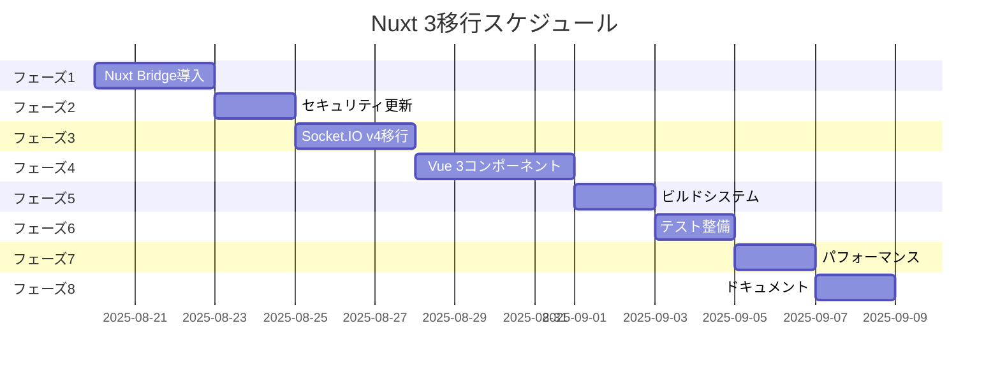

# 技術設計書

## 概要
本設計書は、ShogiWebroomアプリケーションをNuxt 2からNuxt 3へ段階的に移行するための技術的アプローチを詳述します。Nuxt Bridgeを使用した移行戦略により、既存機能を維持しながらセキュリティ脆弱性を解消し、最新のVue 3エコシステムへの移行を実現します。

## アーキテクチャ設計

### 現状アーキテクチャ（Nuxt 2）
```
┌─────────────────────────────────────────────────┐
│                   Client Browser                 │
├─────────────────────────────────────────────────┤
│              Nuxt 2 + Vue 2 Frontend             │
│              - Bootstrap Vue                     │
│              - Socket.IO Client v2               │
└─────────────────────────────────────────────────┘
                           ↓↑
┌─────────────────────────────────────────────────┐
│              Express + Nuxt 2 SSR               │
│              - Socket.IO Server v2               │
│              - Webpack 4 Build                   │
└─────────────────────────────────────────────────┘
                           ↓↑
┌─────────────────────────────────────────────────┐
│                   Redis Store                    │
└─────────────────────────────────────────────────┘
```

### 目標アーキテクチャ（Nuxt 3）
```
┌─────────────────────────────────────────────────┐
│                   Client Browser                 │
├─────────────────────────────────────────────────┤
│              Nuxt 3 + Vue 3 Frontend             │
│              - Vue 3 Compatible UI               │
│              - Socket.IO Client v4               │
└─────────────────────────────────────────────────┘
                           ↓↑
┌─────────────────────────────────────────────────┐
│              Nitro Server Engine                 │
│              - Socket.IO Server v4               │
│              - Vite Build System                  │
└─────────────────────────────────────────────────┘
                           ↓↑
┌─────────────────────────────────────────────────┐
│                   Redis Store                    │
└─────────────────────────────────────────────────┘
```

## 移行戦略

### フェーズ1: Nuxt Bridge導入（要件1対応）

#### 1.1 環境準備
```json
// package.json
{
  "dependencies": {
    "nuxt": "npm:nuxt3@latest",
    "@nuxt/bridge": "npm:@nuxt/bridge@latest"
  },
  "engines": {
    "node": ">=18.0.0"
  }
}
```

#### 1.2 設定移行
```typescript
// nuxt.config.ts (TypeScript化)
import { defineNuxtConfig } from '@nuxt/bridge'

export default defineNuxtConfig({
  bridge: {
    vite: false, // 初期は無効化
    nitro: true,
    typescript: true,
    composition: true
  },
  // Nitro実験的WebSocketは使用しない
  nitro: {
    experimental: {
      websocket: false // 明示的に無効化
    }
  },
  // 既存の設定を段階的に移行
})
```

#### 1.3 互換性レイヤー
- Vue 2/3 両方のAPIをサポート
- Options APIとComposition APIの共存
- 段階的なTypeScript導入

### フェーズ2: セキュリティ強化（要件2対応）

#### 2.1 依存関係の更新戦略
```bash
# 脆弱性スキャンと修正
npm audit fix --force
npm update --save

# 主要パッケージの更新
- nuxt: 2.18.1 → 3.x
- socket.io: 2.5.1 → 4.x
- bootstrap-vue: 2.13.1 → @bootstrap-vue-next/bootstrap-vue-next
- express: 4.16.4 → 4.21.x
```

#### 2.2 セキュリティポリシー実装
```typescript
// server/middleware/security.ts
export default defineEventHandler((event) => {
  // CSPヘッダー設定
  setHeader(event, 'Content-Security-Policy', [
    "default-src 'self'",
    "script-src 'self' 'unsafe-inline'",
    "style-src 'self' 'unsafe-inline'",
    "connect-src 'self' wss://*"
  ].join('; '))
  
  // その他のセキュリティヘッダー
  setHeader(event, 'X-Frame-Options', 'SAMEORIGIN')
  setHeader(event, 'X-Content-Type-Options', 'nosniff')
})
```

### フェーズ3: Socket.IO v4移行（要件3対応）

#### ⚠️ 重要: Nitro実験的WebSocketの回避
Nitroの実験的WebSocket機能は本番環境で重大な問題があるため、**使用しません**。
- 開発環境では動作するが、本番ビルドで404エラーが発生
- `listen`フックが本番モードで実行されない
- プラットフォームサポートが不完全

#### 3.1 推奨実装: Nitroプラグインによる Socket.IO統合
```typescript
// server/plugins/socket.io.ts
import type { NitroApp } from "nitropack"
import { Server as Engine } from "engine.io"
import { Server } from "socket.io"
import { defineEventHandler } from "h3"

export default defineNitroPlugin((nitroApp: NitroApp) => {
  const engine = new Engine()
  const io = new Server()
  
  // Socket.IOをengine.ioにバインド
  io.bind(engine)
  
  // 既存のSocket.IOイベントハンドラーを移植
  io.on("connection", (socket) => {
    // 部屋への入室
    socket.on('enterRoom', (data) => {
      socket.join(data.roomId)
      socket.to(data.roomId).emit('userJoined', data)
    })
    
    // 駒の移動
    socket.on('sendMove', (data) => {
      socket.to(data.roomId).emit('move', data)
    })
    
    // チャットメッセージ
    socket.on('sendComment', (data) => {
      socket.to(data.roomId).emit('comment', data)
    })
    
    // その他の既存イベント
    socket.on('send', (data) => {
      socket.to(data.roomId).emit('receive', data)
    })
  })

  // Nitroルーターに統合（実験的WebSocketは使わない）
  nitroApp.router.use("/socket.io/", defineEventHandler({
    handler(event) {
      engine.handleRequest(event.node.req, event.node.res)
      event._handled = true
    }
  }))
})
```

#### 3.2 代替案: 別ポート構成（フォールバック）
本番環境で問題が発生した場合の確実な代替案：

```typescript
// server/socket-server.ts - 独立したSocket.IOサーバー
import { createServer } from 'http'
import { Server } from 'socket.io'
import Redis from 'ioredis'

const httpServer = createServer()
const io = new Server(httpServer, {
  cors: {
    origin: process.env.FRONTEND_URL || 'http://localhost:3000',
    credentials: true
  },
  // v2クライアントとの互換性
  allowEIO3: true
})

const redis = new Redis(process.env.REDIS_URL)

// Socket.IOロジック
io.on('connection', (socket) => {
  // 既存の全イベントハンドラー
})

httpServer.listen(3001)
```

```typescript
// nuxt.config.ts - プロキシ設定
export default defineNuxtConfig({
  nitro: {
    devProxy: {
      '/socket.io': {
        target: 'http://localhost:3001',
        ws: true,
        changeOrigin: true
      }
    },
    // 実験的WebSocketは明示的に無効化
    experimental: {
      websocket: false
    }
  }
})
```

#### 3.3 クライアント側の実装
```typescript
// plugins/socket.client.ts
import { io } from 'socket.io-client'

export default defineNuxtPlugin(() => {
  // クライアント側でのみ実行
  if (process.server) return
  
  const socket = io({
    // 自動再接続戦略
    reconnection: true,
    reconnectionAttempts: 5,
    reconnectionDelay: 1000,
    // トランスポートの優先順位設定
    transports: ['websocket', 'polling']
  })
  
  // 接続状態の監視
  socket.on('connect', () => {
    console.log('Socket.IO connected')
  })
  
  socket.on('disconnect', (reason) => {
    console.warn('Socket.IO disconnected:', reason)
  })
  
  return {
    provide: {
      socket
    }
  }
})
```

#### 3.4 本番環境での動作保証
- 開発環境と本番環境で一貫した動作
- プラットフォーム非依存の実装
- Socket.IO v4の全機能を利用可能
- 既存のSocket.IO v2クライアントとの後方互換性

### フェーズ4: Vue 3移行（要件4対応）

#### 4.1 コンポーネント移行戦略
```typescript
// 移行前（Vue 2 Options API）
export default {
  data() {
    return { count: 0 }
  },
  methods: {
    increment() {
      this.count++
    }
  }
}

// 移行後（Vue 3 Composition API）
<script setup lang="ts">
import { ref } from 'vue'

const count = ref(0)
const increment = () => count.value++
</script>
```

#### 4.2 Vuex → Pinia移行
```typescript
// stores/sfen.ts (Pinia)
export const useSfenStore = defineStore('sfen', () => {
  const board = ref(initialBoard())
  const turn = ref('b')
  
  const movePiece = (from: Position, to: Position) => {
    // 移動ロジック
  }
  
  return { board, turn, movePiece }
})
```

#### 4.3 Bootstrap Vue Next移行
```typescript
// nuxt.config.ts
export default defineNuxtConfig({
  modules: [
    '@bootstrap-vue-next/nuxt'
  ],
  css: ['bootstrap/dist/css/bootstrap.min.css']
})
```

### フェーズ5: ビルドシステム移行（要件5対応）

#### 5.1 Vite設定
```typescript
// nuxt.config.ts
export default defineNuxtConfig({
  vite: {
    optimizeDeps: {
      include: ['socket.io-client', 'moment']
    },
    build: {
      rollupOptions: {
        output: {
          manualChunks: {
            'socket': ['socket.io-client'],
            'ui': ['@bootstrap-vue-next/bootstrap-vue-next']
          }
        }
      }
    }
  }
})
```

#### 5.2 Docker環境更新
```dockerfile
# Dockerfile
FROM node:20-alpine AS builder

WORKDIR /app
COPY package*.json ./
RUN npm ci --only=production

COPY . .
RUN npm run build

FROM node:20-alpine
WORKDIR /app

COPY --from=builder /app/.output .output
COPY --from=builder /app/node_modules node_modules

EXPOSE 3000
CMD ["node", ".output/server/index.mjs"]
```

#### 5.3 CI/CDパイプライン更新
```yaml
# .github/workflows/deploy.yml
name: Deploy to Production

on:
  push:
    branches: [main]

jobs:
  test:
    runs-on: ubuntu-latest
    steps:
      - uses: actions/checkout@v3
      - uses: actions/setup-node@v3
        with:
          node-version: '20'
      - run: npm ci
      - run: npm run test:ci
      - run: npm run build

  deploy:
    needs: test
    runs-on: ubuntu-latest
    steps:
      - uses: actions/checkout@v3
      - uses: superfly/flyctl-actions/setup-flyctl@master
      - run: flyctl deploy --remote-only
```

### フェーズ6: テスト戦略（要件6対応）

#### 6.1 テストフレームワーク更新
```json
// package.json
{
  "devDependencies": {
    "@nuxt/test-utils": "^3.x",
    "@vue/test-utils": "^2.x",
    "vitest": "^1.x",
    "@playwright/test": "^1.x"
  }
}
```

#### 6.2 ユニットテスト移行
```typescript
// test/unit/components/Shogiboard.test.ts
import { describe, it, expect } from 'vitest'
import { mount } from '@vue/test-utils'
import Shogiboard from '~/components/Shogiboard.vue'

describe('Shogiboard', () => {
  it('初期盤面が正しく表示される', () => {
    const wrapper = mount(Shogiboard)
    expect(wrapper.findAll('.piece')).toHaveLength(40)
  })
})
```

#### 6.3 E2Eテスト維持
```typescript
// test/e2e/room.spec.ts
import { test, expect } from '@playwright/test'

test('複数ユーザーが同じ部屋に入室できる', async ({ page, context }) => {
  const page2 = await context.newPage()
  
  await page.goto('/rooms/test-room')
  await page2.goto('/rooms/test-room')
  
  // ユーザー1が駒を動かす
  await page.dragAndDrop('.piece-7g', '.square-7f')
  
  // ユーザー2の画面で同期を確認
  await expect(page2.locator('.square-7f .piece')).toBeVisible()
})
```

### フェーズ7: パフォーマンス最適化（要件7対応）

#### 7.1 バンドル最適化
```typescript
// nuxt.config.ts
export default defineNuxtConfig({
  nitro: {
    prerender: {
      routes: ['/'],
      crawlLinks: false
    },
    compressPublicAssets: true
  },
  
  experimental: {
    payloadExtraction: false,
    renderJsonPayloads: true
  }
})
```

#### 7.2 画像最適化
```typescript
// nuxt.config.ts
export default defineNuxtConfig({
  modules: ['@nuxt/image'],
  image: {
    formats: ['webp', 'avif', 'jpeg'],
    screens: {
      xs: 320,
      sm: 640,
      md: 768,
      lg: 1024,
      xl: 1280
    }
  }
})
```

#### 7.3 パフォーマンスモニタリング
```typescript
// plugins/performance.client.ts
export default defineNuxtPlugin(() => {
  if (process.client) {
    // Web Vitals測定
    onCLS((metric) => console.log('CLS:', metric.value))
    onFID((metric) => console.log('FID:', metric.value))
    onLCP((metric) => console.log('LCP:', metric.value))
  }
})
```

### フェーズ8: ドキュメンテーション（要件8対応）

#### 8.1 移行ガイド構造
```
docs/
├── migration/
│   ├── 01-getting-started.md
│   ├── 02-nuxt-bridge.md
│   ├── 03-vue3-components.md
│   ├── 04-socket-io.md
│   └── 05-deployment.md
├── api/
│   ├── composables.md
│   └── server-api.md
└── troubleshooting.md
```

#### 8.2 コード例とベストプラクティス
```markdown
# docs/migration/03-vue3-components.md

## コンポーネント移行チェックリスト

- [ ] `<script setup>` 構文への移行
- [ ] `v-model` の変更対応
- [ ] `$listeners` → `$attrs` への統合
- [ ] `<transition>` クラス名の変更
- [ ] カスタムディレクティブの更新
```

## 実装スケジュール

### タイムライン


## リスク管理

### 技術的リスク
1. **Nitro実験的WebSocket（高リスク）**
   - リスク: 本番環境での404エラー、プラットフォーム非互換
   - 影響度: 🔴 致命的 - アプリケーションの中核機能が動作しない
   - 対策: **使用を完全に回避**し、Nitroプラグイン方式を採用

2. **Bootstrap Vue互換性**
   - リスク: Bootstrap Vue Nextは完全な互換性を提供しない
   - 影響度: 🟡 中程度 - UI要素の再実装が必要
   - 対策: 段階的移行とカスタムコンポーネント作成

3. **Socket.IO本番環境動作**
   - リスク: 開発と本番の環境差による接続失敗
   - 影響度: 🔴 高 - リアルタイム同期が機能しない
   - 対策: Nitroプラグイン実装と別ポート構成のフォールバック準備

4. **Socket.IO後方互換性**
   - リスク: v2クライアントとの接続問題
   - 影響度: 🟡 中程度 - 一時的な接続エラー
   - 対策: allowEIO3オプションとフォールバック実装

5. **Vuexストア移行**
   - リスク: 複雑な状態管理ロジックの破損
   - 影響度: 🟡 中程度 - 機能の一時的な不具合
   - 対策: 段階的なPinia移行と並行運用期間

### 運用リスク
1. **ダウンタイム**
   - リスク: デプロイ時のサービス停止
   - 対策: Blue-Greenデプロイメント戦略

2. **パフォーマンス劣化**
   - リスク: 初期バンドルサイズの増加
   - 対策: コード分割と遅延ローディング

## 成功指標

### 技術指標
- セキュリティ脆弱性: 80%以上削減
- ビルド時間: 50%短縮（Vite採用により）
- バンドルサイズ: 20%以内の増加に抑制
- テストカバレッジ: 80%以上維持

### ユーザー体験指標
- 初期表示時間: 3秒以内
- WebSocket接続遅延: 100ms以内
- エラー率: 0.1%以下

## 承認事項

### 前提条件
- Node.js 18以上の環境が利用可能
- 開発チームがVue 3/Nuxt 3の基本知識を習得
- 段階的移行期間中の並行開発体制確立

### 制約事項
- 既存のURLパスとAPI互換性の維持
- Redis接続プロトコルの変更不可
- 既存ユーザーデータの完全保持

## 実装上の重要な注意事項

### Socket.IO実装の安定性確保
1. **Nitro実験的WebSocketを使用しない**
   - 本番環境での404エラーを回避
   - プラットフォーム互換性の問題を防止

2. **推奨実装順序**
   - 第1選択: Nitroプラグイン方式（server/plugins/socket.io.ts）
   - 第2選択: 別ポート構成（確実なフォールバック）

3. **本番環境テスト必須項目**
   - Socket.IO接続の確立確認
   - リアルタイム同期の動作検証
   - 再接続処理の確認

## 次のステップ
1. 要件と設計のレビュー・承認
2. 開発環境でのNuxt Bridge導入検証
3. **Socket.IO実装の本番環境シミュレーション**
4. 実装タスクの詳細化と優先順位付け
5. 移行開始とフェーズ1の実装